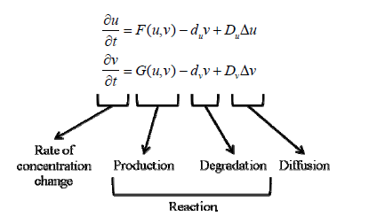
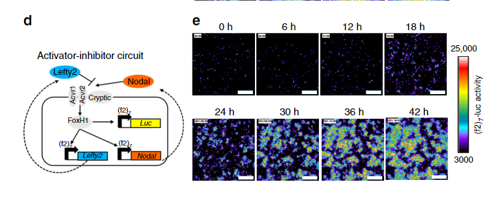
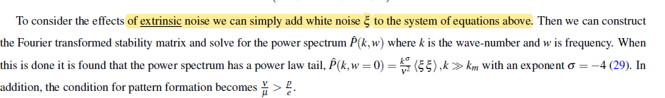

#  2021.9.15

+   due: 14days

+   图灵斑图是什么？(Turing Pattern)
+   图灵斑图的失稳条件

# Reaction Diffusion Model

+   original problem: explain how biological spatial patterns are formed

+   Bio image of the RD model: a system of cells interactin by the ligands and receptors

    

(Kondo, 2010)  in SOM

two kinds of lingands u and v, which satisfy the following conditons:

1.   diffusible
2.   cells have receptors for both
3.   ligands interactions with each other

+   RD model

    
    +   u is activator
    +   v is inhibitor

+   Turing's original paper:

    

+   RD model can generate six potential steady states 

    

    (Kondo, 2010)

# Turing Pattern

+   definition: a kind of nonlinear wave that is maintained by the
    dynamic equilibrium of the system (fig A, VI)

+   形成条件

    In Turing's model, substance P promotes the production of more substance P as well as substance S. However, substance S inhibits the production of substance P;

    +    if **S diffuses more readily than P**, sharp waves of concentration differences will be generated for substance P. 

+   An important feature of Turing´s model is that particular wavelengths in the substances' distribution will be amplified while other wavelengths will be suppressed

# Turing Instability (diffusion-driven instability)

>   Mathematical Biology II: Spatial Models and Biomedical Applications, Third Edition

+   definition: the homogeneous steady state is stable to small perturbations in the absence
    of diffusion but unstable to small spatial perturbations **when diffusion is present**

+   math results: zero flux conditions(no external input)

    

    +   stable to small perturbations without diffusion:

        
        $$
        f_u\cdot g_v<0
        $$
        
    +   unstable with diffusion
    
        ​[image-20210928150543073](./Notes_for_PatterFormation.assets/image-20210928150543073.png)
    
        
    
        
    
+   intuition: 

    ​	

    

+   文献调研： 已有最大课题组 以及课题

# 2021.9.30

1. 总结一下近年来，对于“生物中的斑图”的研究进展，特别是以合成生物学方法人工设计斑图的：有哪几个大组，做了什么工作，用了什么方法。

    

2. 参考前人文献，看基于细胞的图灵斑图，应该如何建模

# progress of synthetic biological pattern  

>   Luo et al. 2019

#### Non-autonomous patterns

+   with prepatterned environmental cues, like morphogen gradients

1.   pattern formation with morphogen gradients( band pass system)

     +   **character:** two antagonizing pathways with different kinetics: negative & positive

         +   pattern tuned by 
             +   morphogen gradient
             +   circuit modulation

     +   **1960s Lewis Wolpert Frech Flag model**

         >   Wolpert, L. (1969) Positional information and the spatial pattern
         >   of cellular differentiation. J. Theor. Biol. 25, 1−47

     +   AHL-GFP system: 

         >   Basu, S., Gerchman, Y., Collins, C., Arnold, F., and Weiss, R.
         >   (2005) A synthetic multicellular system for programmed pattern
         >   formation. Nature 434, 1130−1134

     +   kill-death by ampicillin concentration

         >   Sohka, T., Heins, R. A., Phelan, R. M., Greisler, J. M., Townsend,
         >   C. A., and Ostermeier, M. (2009) An externally tunable bacterial bandpass
         >   filter. Proc. Natl. Acad. Sci. U. S. A. 106, 10135−10140.

     +   nisin dual func molecule:

         >   Greber, D., and Fussenegger, M. (2010) An engineered
         >   mammalian band-pass network. Nucleic Acids Res. 38, No. e174.

     +   James Sharpe: **All possible netowrks that can form stripes** with theoretical & experiments

         >   Schaerli, Y., Munteanu, A., Gili, M., Cotterell, J., Sharpe, J., and
         >   Isalan, M. (2014) A unified design space of synthetic stripe-forming
         >   networks. Nat. Commun. 5, 4905.

2.   pattern formation with prepatterned enviro cues

     +   light-dark edges system: Tabor et al. 2009

#### self-organized patterns

+   with uniform initial conditions

1.   1952, Alan Turing: **reaction-diffusion pattern** 

     >   Turing, A.M. (1952). The chemical basis of morphogenesis. Phil. Trans. R. Soc.
     >   Lond. B 237, 37–72.

     +   pattern formation is triggered by diffusion-driven instability. (Kondo et al. 2010)

     +   behavior, topology, properties of turing patterns: 

         >   (28) Zheng, M. M., Shao, B., and Ouyang, Q. (2016) Identifying
         >   network topologies that can generate turing pattern. J. Theor. Biol. 408,
         >   88−96.
         >   (29) Dillon, R., Maini, P. K., and Othmer, H. G. (1994) Pattern-
         >   Formation in Generalized Turing Systems 0.1. Steady-State Patterns in
         >   Systems with Mixed Boundary-Conditions. J. Math Biol. 32, 345−393.
         >   (30) Diego, X., Marcon, L., Muller, P., and Sharpe, J. (2018) Key
         >   Features of Turing Systems are Determined Purely by Network
         >   Topology. Phys. Rev. X 8, 021071.

     +   obstacle to generate Turing patterns in living system: the constraint on paras
         +   diffusion rate of activator much larger than that of inhibitor (Koch & Meinhardt, 1994)
         +   **constraint can be relaxed considering the stochasticity**(Karig et al. 2018)
         +   constraint can be relaxed if depending on the initial conditions(Sekine et al. 2018)
         
     +   core-ring pattern of gene expression, bacterial colonies

         >   Payne, S., Li, B., Cao, Y., Schaeffer, D., Ryser, M. D., and You, L.
         >   (2013) Temporal control of self-organized pattern formation without
         >   morphogen gradients in bacteria. Mol. Syst. Biol. 9, 697.

         +   scale invariance explained(Cao et al. 2016)
         +   morphogen as a temporal cue (Cao et al. 2016)

2.   **density dependent motility**(Liu et al. 2011)

     +   patterns of alternating rings of high and low cell densities within
         a bacterial colony 
     +   mechanism: 
         +   Accumulating cell density slows local cell movement, creating aggregates of
             nonmotile cells that keep trapping more cells. 
         +   Escaping cells rapidly spread out, leaving regions with low cell density, and
             move into the front with abundant nutrients where the cell
             density increases.

3.   **differentiated cell adhesion**

     +   phase separation of two cell types by different cadherins  (Cachat et al. 2016)

     +   sequential pattern formation and structure development
         following the genetic coding of cell−cell contact-mediated
         cell adhesion and differentiation

         >   Toda, S., Blauch, L. R., Tang, S. K. Y., Morsut, L., and Lim, W. A.
         >   (2018) Programming self-organizing multicellular structures with
         >   synthetic cell-cell signaling. Science 361, 156−162.

     +   expanded the inventory for designing cell adhesion-based patterns(Glass et al. 2018)

         +   cell adhesion alone  can result in  various selforganized
             multicellular patterns.

### tools to build synthetic patterns

#### Cell−cell communication

+   bacterial quorum sensing and fungal pheromone communication (Hennig et al. 2015)

+   cell surface sensors and diffusible signals in bacteria and eukaryotic systems

    +   small peptides, cell wall components, small RNAs, and secondary metabolites

        >   (46) Visick, K. L., and Fuqua, C. (2005) Decoding microbial chatter:
        >   cell-cell communication in bacteria. J. Bacteriol. 187, 5507−5519.
        >   (47) von Bodman, S. B., Willey, J. M., and Diggle, S. P. (2008) Cell-cell
        >   communication in bacteria: united we stand. J. Bacteriol. 190, 4377−
        >   4391.
        >   (48) Mittelbrunn, M., and Sanchez-Madrid, F. (2012) Intercellular
        >   communication: diverse structures for exchange of genetic information.
        >   Nat. Rev. Mol. Cell Biol. 13, 328−335.

    +   ion-mediated bioelectric signaling

        >   (49) Prindle, A., Liu, J., Asally, M., Ly, S., Garcia-Ojalvo, J., and Süel,
        >   G. M. (2015) Ion channels enable electrical communication in bacterial
        >   communities. Nature 527, 59−63.
        >   (50) Adams, D. S., and Levin, M. (2013) Endogenous voltage
        >   gradients as mediators of cell-cell communication: strategies for
        >   investigating bioelectrical signals during pattern formation. Cell Tissue
        >   Res. 352, 95−122.
        >   (51) McNamara, H. M., Zhang, H. K., Werley, C. A., and Cohen, A. E.
        >   (2016) Optically Controlled Oscillators in an Engineered Bioelectric
        >   Tissue. Phys. Rev. X 6, 031001.

#### cell−cell adhesion

+   cadherin (Halbleib et al. 2006)
+   nanobody-based system (Glass et al. 2018)

#### mathematical modeling

+   identify the essential components and network topology through screening of the design space(Schaerli et al. 2014 )
+   identify the important constraints for the parameter space(Cao et al. 2016)

# Leading Groups and Major Contributions

## Morphogeon gradients

### Satoshi Toda: Diffusible synNotch

>   Satoshi Toda et al., (202010) Engineering synthetic morphogen systems that can program multicellular patterning

+   spatial distribution of morphogens can be regulated by the density of anchor protein and antimorphogen inhibitors

+    supports the idea that arbitrary proteins  can be converted into morphogens

+   create patterns with two & three distinct domains

    

### Michael B. Elowitz:  Hedgehog (HH) pathway(long-range morphogen system)

>   Pulin Li et al. 2018

+    the combination of **double-negative regulatory logic** and negative feedback through the PTCH receptor accelerates gradient formation and improves robustness to variation in the morphogen production rate compared with alternative design

### Ron Weiss :AHL-GFP system

>   Subhayu Basu et al. 2005

+   results:
    +   which genetically engineered ‘receiver’ cells are programmed to formring-like patterns of differentiation based on chemical gradients of an acyl-homoserine lactone (AHL) signal that is synthesized by ‘sender’ cells.
    +   other patterns like ellipses can be achieved by placing senders in different spatial places
+   math. model: five speciesmodel by ODEs

### James Sharpe and Mark Isalan: all possible 3-node networks for stripe-forming

+   the four known types of incoherent feedforward loops35 (I-FFL: I1-I4).

+   The close match we achieved between theory and experiments gave us confidence in engineering further networks.

+   methods: all possible networks tested by simulation & verified by experiments

    +   experiments: 

        +   rather than just assaying the stripe pattern gene
            (from the GFP fluorescence; Fig. 4), **we measured the activity of**
            **all three nodes of the network**, using reverse transcription
            quantitative PCR of the messenger RNA (mRNA) levels at
            different concentrations of arabinose
        +   made a series of mutations to each core
            network, to alter quantitatively the effective strength of specific
            regulatory links**. For each mutation, the expected impact on**
            **regulation was known** from the literature

    +   result comparison: standard modelling approach based on equilibrium binding of
        transcription factors to their sites on a promoter

        >   Bintu, L. et al. Transcriptional regulation by the numbers: applications. Curr.
        >   Opin. Genet. Dev. 15, 125–135 (2005).

## Reaction-diffusion model

### Tatsuo Shibata: Nodal-Lefty network

>   R. Sekine, T. Shibata, M. Ebisuya, Nat. Commun. 9, 5456 (2018).

+   Nodal is a short-range activator whereas Lefty is a long-range inhibitor

+   results:

    +   a reconstituted Nodal-Lefty network in mammalian cells spontaneously gives rise to a pattern

        

    +   mathematical shows paras space similar to turing pattern 

### Nigel Goldenfeld: Stochastic turing pattern

>   Robust ecological pattern formation induced by demographic noise

+   include intrinsic noise arising from activator and inhibitor birth and death processes (5–8).

+   stochastic algorithm: **an efficient tau-leaping stochastic algorithm**

    >   Cao Y, Gillespie D, Petzold L (2006) Efficient step size selection for the tau-leaping simulation method. J. Chem. Phys. 124:044109.

+   Finding:

    +   Demographic noise would maintain these patterns by generating continual perturbations.

        

+   calc: plankton-herbivore dynamics model

    

    +   we set p1 = 0 and p2 = p for transparency of analysis. This does not change the qualitative results. 

    +   The parameters e and p, d identify the prey (plankton$\psi$) as the activator and the predator (Herbivore)$\phi$ as the inhibitor

    +   original Turing Pattern condition:

        

    +   **extrinsic noise** as white noise $\xi$

        

    +   **intrinsic noise** 

        

        

        

### Nigel Goldenfeld & Ron Weiss: sysnthetic bacterial population verifying stochastic turing pattern

+   the A3OC12HSL activator diffuses more slowly than the IC4HSL inhibitor

+   result: diffuse ratio inhibitor/activotor = 21.6

# Joel Stavans: Robust stochastic turing patterns demographic noise

+   findings: **Noise can seed** the formation of transient, stochastic Turing patterns for parameter values in which deterministic patterns do not form. These patterns can then be fixed by downstream genetic commitment pathways.

+   model: a minimal, stochastic model of developmental patterns in Anabaena that includes 

    +   a nondiffusing activator, 
    +   two diffusing inhibitor
        morphogens, 
    +   demographic fluctuations in the number of morphogen molecules, 
    +   and filament growth

+   the deviations from the classical Turing patter model:

    +   no evidence for diffusion of the activator HetR between cells along Anabaena filaments
    +   two HetR inhibitors instead of one: PatS and HetN
        +   PatS and HetN have different spatiotemporal roles during pattern maintenance
    +   the diffusion constants of PatS- and HetNderived morphogens may be comparable.
    +   Anabaena filaments continually grow by cell growth and division.(not fixed spatial size)

    

    ​	

+   stochastic model sim

    +   numerical simulations at finite V using the Gillespie's algorithm 

    +   Patterns on a growing filament

         

    +   parameter spaces comparision 

        

        ​	βR is the strength of the positive autoregulation of HetR

           HetR activates production of PatS [54], with strength βS

        

# model based on cellular turing pattern

>    Schweisguth & Corson, Developmental cell review, Self-Organization in Pattern Formation

models in different scale levels:

1.   models describe the form of geometric rules

     >   Cheng et al., 2014
     >
     >   Hannezo et al., 2017

2.   dynamic models about the interacting elements (non molecular level)

     >   (Corson and Siggia, 2017; Franc¸ ois and Siggia, 2012).

3.   live image of gene expression & signaling activity 
     +   self-organization of the early mammalian embryo (Etoc et al.,
         2016)

# 2021/10/26 mail: questions about simulating diffusioncoupled with cells

>   HI Zhiyuan, 
>
>   it’s so nice to hear from you! So sorry - I almost missed your message - for some reason it went directly to my spam folder and by pure chance I checked the spam folder today and saw it!! So sorry - I don’t know why that happened - maybe the huji filter is not used to Chinese characters in the email and correlates them with some past fishing event. 
>
>   We are all well, thanks for asking. And you? Now, after the 3rd vaccination, life is almost back to normal in Israel. I’m definitely planning to come to Ned’s birthday. 
>
>   Regarding your question - I do have a two-cell coupled diffusion simulation which I’d be happy to share, and my collaborator has a 1-dimensional (many cell) coupled diffusion system he might share with you. I’m not sure this is what you’re looking for though. 
>
>   The two-cell work pertains to this manuscript: 
>
>   [Cell-to-cell information at a feedback-induced bifurcation point](https://scholar.google.com/citations?view_op=view_citation&hl=en&user=iw1X5RgAAAAJ&sortby=pubdate&citation_for_view=iw1X5RgAAAAJ:SdhP9T11ey4C) 
>
>   A Erez, TA Byrd, M Vennettilli, A Mugler 
>
>   Physical Review Letters 125 (4), 048103 
>
>   
>
>   Whereas the multi-cell: 
>
>   [Multicellular sensing at a feedback-induced critical point](https://scholar.google.com/citations?view_op=view_citation&hl=en&user=iw1X5RgAAAAJ&sortby=pubdate&citation_for_view=iw1X5RgAAAAJ:5awf1xo2G04C) 
>
>   M Vennettilli, A Erez, A Mugler 
>
>   Physical Review E 102 (5), 052411 
>
>   The code for the two-cell case is available on 
>
>   https://github.com/AmirErez/TwoCellInformation/ 
>
>   I’d be happy to connect you with Mike in case you’re interested in the multi-cell code. 

## Multicellular sensing at a feedback-induced critical point
 
## Cell-to-cell information at a feedback-induced bifurcation point